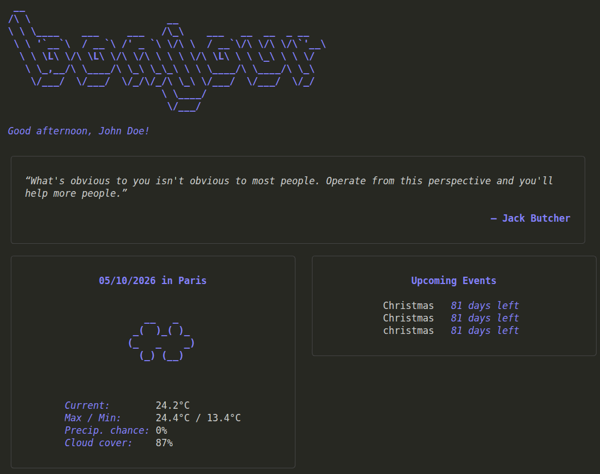
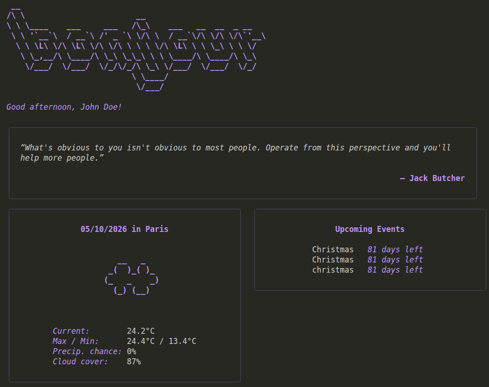
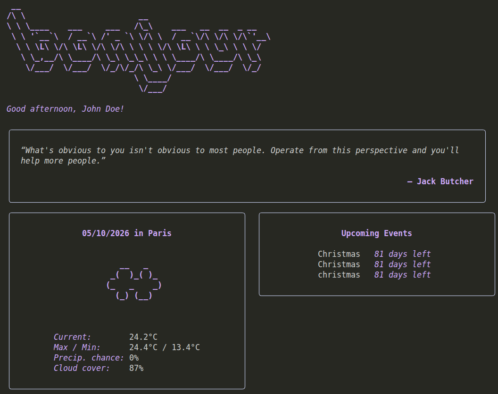
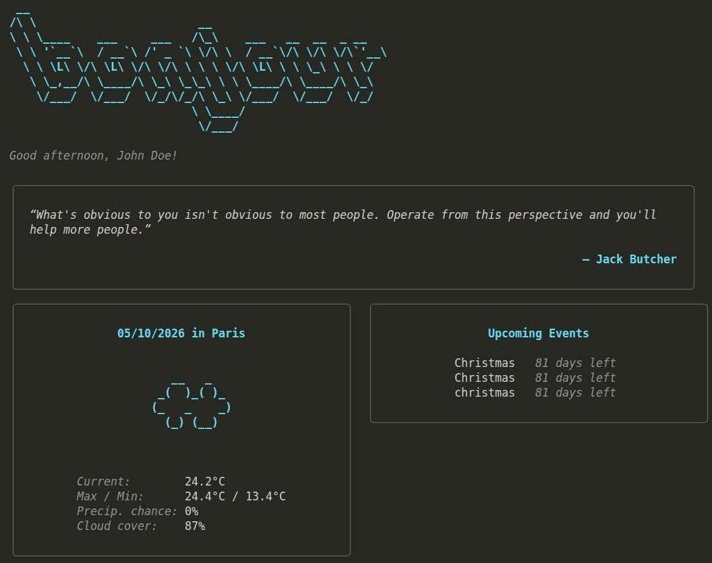

# Usage Guide

> Learn how to effectively use `bonjour`. From special commands to flags and environment variables.

## Basic Usage

Run the default dashboard by executing `bonjour` without any arguments:

```bash
bonjour
```

To view general help or options at any time, run:

```bash
bonjour --help
```

You can check your current `bonjour` version with:

```bash
bonjour --version
```

## Command Line Flags

Flags allow you to customize the layout and content shown when launching `bonjour`.

| Flag | Short | Description |
| --- | --- | --- |
| `--help` | `-h` | Display help information for `bonjour` |
| `--mini` | | Execute and display a compact dashboard view |
| `--noevents` | | Hide the events module |
| `--noquotes` | | Hide the daily quotes module |
| `--noweather` | | Hide the weather module |
| `--version` | `-v` | Display the current installed version of `bonjour` |

### Flag Examples

* **Display a compact view without weather:**

```bash
bonjour --mini --noweather
```

* **Disable both events and quotes:**

```bash
bonjour --noevents --noquotes
```

## Commands

### `config`

Opens the interactive configuration wizard to edit your settings.

```bash
bonjour config
```

### `events`

Opens the interactive events wizard to manage your daily schedule (add, edit, or delete events).

```bash
bonjour events
```

### `completion`

Generates auto-completion scripts for your preferred shell (e.g., `bash`, `zsh`, `fish`, `powershell`).

```bash
# Example: Generate completion for Zsh
bonjour completion zsh
```

### `help`

Provides detailed help for any specific command.

```bash
bonjour [command] --help
```

## Environment Variables

### NO_COLOR

`bonjour` honors the standard [NO_COLOR](https://no-color.org/) environment variable specification. When set to any non-empty string, ANSI color codes and text styling will be disabled across all output.

```bash
# Run once without color output
NO_COLOR=1 bonjour

# Disable color output for the current terminal session
export NO_COLOR=1
bonjour
```

## Customizing the look

By running the `bonjour config` command and then selecting `dashboard configuration` and clicking enter, the user is given a list of UI themes to choose from. Here is the full list of themes and how each looks on a dark terminal:

- charm



- dracula



- catpuccin



- base16



## Automatic execution

To have `bonjour` greet you every time you open a new terminal window, add the command to the end of your shell startup configuration file after a successful installation:

### Linux & macOS

1. Identify your shell by running:

   ```bash
   echo $SHELL
   ```

2. Add `bonjour` to your shell configuration. You can also add flags directly (like `--mini`).
   * bash (`./bashrc`):

    ```bash
    echo -e "\nbonjour" >> ~/.bashrc
    ```

   * zsh (`./zshrc`):

    ```bash
    echo -e "\nbonjour" >> ~/.zshrc
    ```

3. Restart your terminal or reload your config

   ```bash 
   source ~/.bashrc
   ```

4. Open a terminal. `bonjour` should have started up automatically!

### Windows

1. Open PowerShell and check if a profile script exists, or create one:

```PowerShell
if (!(Test-Path $PROFILE)) { New-Item -Type File -Path $PROFILE -Force }
```

2. Open your profile in a text editor:

```PowerShell
notepad $PROFILE
```

3. Add bonjour on a new line at the bottom of the file, save, and exit.
4. Reopen PowerShell to see bonjour run automatically.